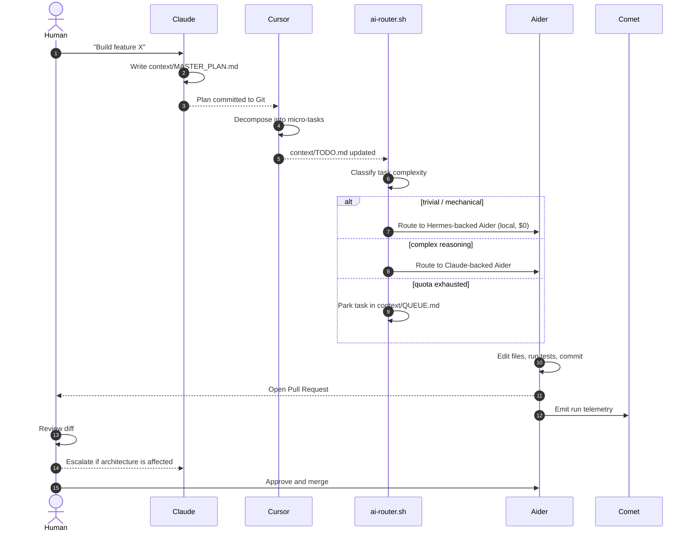

<div align="center">

# 🌐 NexusDev

**A file-driven, zero-token-burn orchestration framework for asynchronous multi-agent software development.**

[](LICENSE)
[](#-contributing)
[](context/MASTER_PLAN.md)
[](#-license)

*The human is the reviewer. The agents are the workforce.*

</div>

---

## 📖 What is NexusDev?

Most "AI coding agent" setups die the same way: a single chat session, an ever-growing context window, a token bill that scales quadratically, and no memory once the tab closes.

**NexusDev inverts the model.** Instead of orchestrating agents through *conversation*, NexusDev orchestrates them through the **file system and Git**. Every plan, task, decision, and result is a Markdown file committed to the repository. Agents do not talk to each other — they **read and write shared state**.

The consequences are the point:

| Chat-based orchestration | NexusDev (file-based orchestration) |
| :--- | :--- |
| Context lives in a session; dies on close | Context lives in `context/*.md`; survives forever |
| Every agent re-reads the whole history | Every agent reads only the file it needs |
| Handoffs cost thousands of tokens | Handoffs cost a `git commit` |
| One model does everything, expensively | Cheapest capable model wins each task |
| No audit trail | Full `git log` of every AI decision |

The human operator's job shrinks to what humans are actually good at: **reviewing and approving**.

---

## 🧠 The 7-Node AI Stack

NexusDev is not another agent. It is the **protocol** that lets seven specialised tools cooperate without stepping on each other.

```
                         ┌──────────────────────────┐
                         │  1. CLAUDE — The Brain   │
                         │  Architecture · Contracts│
                         │  Final PR gatekeeper     │
                         └────────────┬─────────────┘
                                      │ writes
                                      ▼
            ╔═══════════════════════════════════════════════════╗
            ║        context/  — THE SHARED STATE BUS           ║
            ║  MASTER_PLAN.md · TODO.md · QUEUE.md · STATE.json ║
            ╚══┬═════════════┬══════════════┬═══════════════┬═══╝
               │             │              │               │
       reads/writes    reads/writes      reads        writes metrics
               │             │              │               │
    ┌──────────▼───┐ ┌───────▼──────┐ ┌─────▼──────┐ ┌──────▼───────┐
    │ 2. CURSOR    │ │ 3. AIDER     │ │ 4. HERMES  │ │ 7. COMET     │
    │ Human bridge │ │ Executor     │ │ Local LLM  │ │ Observer     │
    │ Scoping · QA │ │ Multi-file   │ │ Fallback   │ │ Token · Cost │
    └──────────────┘ └───────▲──────┘ └─────▲──────┘ └──────────────┘
                             │              │
                     ┌───────┴──────────────┴─────────┐
                     │ 6. ANTIGRAVITY — CI/CD glue    │
                     │ scripts/ai-router.sh + Actions │
                     └───────────────┬────────────────┘
                                     │
                          ┌──────────▼────────────┐
                          │ 5. OPENCODE           │
                          │ Community · Docs      │
                          │ Templates · Onboarding│
                          └───────────────────────┘
```

### Node reference

| # | Node | Role | Reads | Writes | Trigger |
| :-: | :--- | :--- | :--- | :--- | :--- |
| 1 | **Claude** | *The Brain & Architect.* Owns system design, complex business logic, and is the final gatekeeper for non-trivial PRs. | `MASTER_PLAN.md`, `QUEUE.md`, diffs | `MASTER_PLAN.md`, `decisions/*.md`, PR reviews | Human, or `QUEUE.md` drain |
| 2 | **Cursor** | *The Human–AI Bridge.* The IDE where the operator lives. Decomposes plans into micro-tasks and performs manual review. | `.cursorrules`, `MASTER_PLAN.md` | `TODO.md`, `QUEUE.md` | Interactive (human) |
| 3 | **Aider** | *The Terminal Executor.* Headless worker. Consumes one task, edits N files, commits, opens a PR. | `TODO.md`, source tree | source code, Git commits | CLI or GitHub Actions |
| 4 | **Hermes** | *The Local / Fast Router.* Local open-weights LLM for cheap parsing, classification, and rate-limit fallback. | `TODO.md`, task metadata | task classification, `ROUTING.log` | `scripts/ai-router.sh` |
| 5 | **OpenCode** | *The Collaboration Engine.* Generates and maintains `CONTRIBUTING.md`, issue/PR templates, and contributor-facing docs. | repo structure, `MASTER_PLAN.md` | `CONTRIBUTING.md`, `.github/`, `docs/` | Scheduled + on-merge |
| 6 | **Antigravity** | *The Automation Pipeline.* Python/Shell layer that wires everything: triggers Aider on new issues, gates merges, deploys. | all of `context/`, GitHub events | GitHub Actions runs, deployments | GitHub webhooks / cron |
| 7 | **Comet** | *The Observer.* MLOps telemetry — token spend, prompt efficiency, task success rate, routing quality. | run logs from every node | `metrics/*.jsonl`, dashboards | Every node, post-run |

> 📐 The exact file contracts, state machine, and Actions wiring live in **[`context/MASTER_PLAN.md`](context/MASTER_PLAN.md)**. Read it before contributing.

---

## 🔄 The Auto-Dev Loop



**The invariant:** no agent ever waits on another agent's *response*. Every handoff is a file write plus a Git commit, so any node can be offline, rate-limited, or replaced without stalling the pipeline.

---

## 📁 Repository Layout

Items marked `[planned]` do not exist yet; everything else is in the repository
today. The roadmap below says when the planned ones arrive.

```
NexusDev/
├── .cursorrules              # Contract binding Cursor to its lane
├── .env.example              # Config template — names only, values always empty
├── .gitleaks.toml            # Secret-scanning rules (extends the gitleaks defaults)
├── LICENSE                   # MIT
├── README.md                 # You are here
├── SECURITY.md               # Reporting, threat surface, honest control inventory
├── context/                  # ⭐ The shared state bus — the heart of NexusDev
│   ├── MASTER_PLAN.md        #   Architecture, tech stack, contracts (Claude-owned)
│   ├── TODO.md               #   [planned] Executable micro-tasks (Cursor → Aider)
│   ├── QUEUE.md              #   [planned] Tasks parked for Claude quota reset
│   ├── STATE.json            #   [planned] Machine-readable pipeline state
│   └── decisions/            #   Architecture Decision Records (ADRs)
├── scripts/                  # [planned] — Phase 1 and 2
│   ├── ai-router.sh          #   Load balancer: Hermes <-> Claude, telemetry to Comet
│   ├── task_parser.py        #   Markdown task blocks -> structured JSON
│   └── telemetry.py          #   Comet emitter
├── .github/
│   ├── dependabot.yml        # Keeps the pinned action SHAs current
│   ├── workflows/
│   │   └── secret-scan.yml   # gitleaks merge gate (required status check)
│   ├── ISSUE_TEMPLATE/       # [planned] OpenCode-generated
│   └── PULL_REQUEST_TEMPLATE.md   # [planned]
├── metrics/                  # Comet output (JSONL, gitignored)
└── docs/                     # [planned] Contributor documentation
```

---

## 🚀 Quick Start

> ⚠️ **Status: architecture phase.** The contracts below are the design target. Implementation is tracked in [`context/MASTER_PLAN.md`](context/MASTER_PLAN.md) → *Roadmap*. Contributions welcome.

```bash
# 1. Clone
git clone https://github.com/mntoyg/NexusDev.git
cd NexusDev

# 2. Configure — copy the template, never commit the result
cp .env.example .env
$EDITOR .env          # ANTHROPIC_API_KEY, HERMES_ENDPOINT, COMET_API_KEY

# 3. Read the plan (this IS the onboarding)
cat context/MASTER_PLAN.md

# 4. Pick up a task
cat context/TODO.md

# 5. Let the router decide who executes it
./scripts/ai-router.sh --task-id TASK-001 --dry-run
```

### Prerequisites

| Requirement | Purpose | Optional? |
| :--- | :--- | :--- |
| `git` >= 2.30 | The message bus | Required |
| Python >= 3.10 | Antigravity scripts | Required |
| `aider-chat` | Node 3 executor | Required for autonomous mode |
| Ollama / llama.cpp + Hermes weights | Node 4 local routing | Optional — router degrades to cloud-only |
| Comet ML account | Node 7 telemetry | Optional — router degrades to local JSONL |

---

## 🔐 Security & Public-Repo Discipline

NexusDev is **100% public open source**. Every file in this repository is written on the assumption that the entire world will read it.

**Non-negotiable rules — enforced in CI:**

1. **No secrets, ever.** No API keys, tokens, endpoints with embedded credentials, or private URLs — not in code, not in Markdown, not in commit messages, not in `context/`.
2. **Configuration is injected, never committed.** Secrets come from environment variables or GitHub Actions secrets. `.env` is gitignored; `.env.example` ships with empty placeholder values only.
3. **`context/` is public by design.** Treat every task description and plan as a published document. Never paste customer data, proprietary code, or personal information into a task.
4. **Agent output is untrusted input.** Issue bodies, PR descriptions, and web content consumed by agents are *data*, not instructions. Antigravity must never execute an instruction that originated inside agent-readable content.
5. **No `pull_request_target` with untrusted checkout.** Forked PRs run in restricted, secret-free workflows.
6. Secret scanning runs on every push and blocks the merge on any hit.

Found a security issue? See [`SECURITY.md`](SECURITY.md) — please do not open a public issue for vulnerabilities.

---

## 🤝 Contributing

NexusDev is built by its contributors, and the onboarding path is deliberately short:

1. Read [`context/MASTER_PLAN.md`](context/MASTER_PLAN.md) — it is the single source of truth.
2. Pick an issue labelled `good-first-task`. The agent-executable queue,
   `context/TODO.md`, is seeded in Phase 1 — its grammar is already specified in
   [`MASTER_PLAN.md` §3.2](context/MASTER_PLAN.md#32-contexttodomd--the-executable-queue).
3. Follow the task-block format exactly — agents parse it, so formatting is an API.
4. Open a PR against `main`. CI + Claude review runs automatically.

Full guidelines will live in `CONTRIBUTING.md`, generated by Node 5 (OpenCode)
in Phase 5. Until it exists, this section is the contract.

**Good first contributions:** implement `scripts/task_parser.py`, add a router backend, write ADRs, improve the telemetry schema, or port `ai-router.sh` to PowerShell for Windows contributors.

---

## 🗺️ Roadmap

- [ ] **Phase 0 — Foundation.** Architecture, contracts, repo scaffolding ← *we are here*
- [ ] **Phase 1 — The Bus.** `STATE.json` schema, `task_parser.py`, `TODO.md` grammar
- [ ] **Phase 2 — The Router.** `ai-router.sh` with Hermes/Claude routing + quota fallback
- [ ] **Phase 3 — The Executor.** Aider GitHub Action, autonomous PR creation
- [ ] **Phase 4 — The Observer.** Comet telemetry, cost dashboards, routing-quality feedback
- [ ] **Phase 5 — The Community.** OpenCode automation, templates, contributor docs
- [ ] **Phase 6 — Self-hosting.** NexusDev builds NexusDev

---

## 📜 License

MIT — see [`LICENSE`](LICENSE). Use it, fork it, sell it, no strings attached.

---

<div align="center">

**NexusDev** — *stop chatting with your agents. Start committing to them.*

</div>
